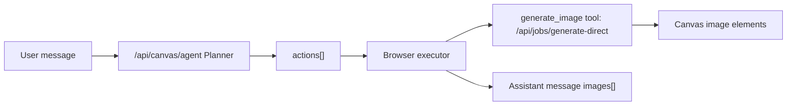

# Canvas Agent Workflow Implementation Plan

> **For agentic workers:** REQUIRED SUB-SKILL: Use superpowers:subagent-driven-development (recommended) or superpowers:executing-plans to implement this plan task-by-task. Steps use checkbox (`- [ ]`) syntax for tracking.

**Goal:** Upgrade the canvas AI sidebar from a single prompt rewriter into a lightweight task Agent that can plan multiple image-generation actions from one user request and place each result back on the canvas.

**Architecture:** Use a small local Agent architecture inspired by OpenAI Agents tool calls, LangGraph state/action workflows, and CrewAI Flows: `/api/canvas/agent` is the Planner that returns structured `actions[]`; the browser sidebar is the Executor that calls the existing `generate_image` tool (`requestCanvasGenerate`) once per action and updates canvas state after each result. V1 deliberately reuses the existing one-job-one-image queue path instead of changing the worker/job runner.

**Tech Stack:** Cloudflare Pages Functions, vanilla JS canvas app, D1/R2-backed existing job APIs, Node test runner VM harnesses.

---

## File Structure

- Modify `functions/api/canvas/agent.ts`: extend Agent prompt and normalizer to return `actions[]` while keeping legacy `prompt`/`shouldGenerate` compatibility and passthrough behavior.
- Modify `public/app.js`: add action normalization/execution helpers, support multiple result images per assistant message, lay out placeholders/results on the canvas, and keep old single-image history compatible.
- Modify `tests/canvas-ai-history.test.mjs`: cover multi-image assistant message sanitize/serialize compatibility.
- Modify `tests/canvas-generate-routing.test.mjs`: cover Agent action normalization/execution helpers with multiple planned image actions.
- Optional docs update only if behavior text already exists nearby; do not broaden scope into a full product manual.

## External Architecture Notes

- OpenAI Agents style: planner decides tool calls; runtime executes tools and records results.
- LangGraph style: keep explicit state (`message`, `history`, `canvasContext`, `actions`, `results`) and route actions predictably.
- CrewAI Flow style: use deterministic flow control around LLM outputs; do not depend on the LLM to execute side effects.

V1 translation for this repo:



## Task 1: Planner Protocol

**Files:**
- Modify: `functions/api/canvas/agent.ts`

- [ ] **Step 1: Extend the system prompt**

Change the strict JSON schema to include:

```json
{
  "reply": "Chinese reply shown in chat",
  "shouldGenerate": true,
  "prompt": "legacy single image prompt",
  "mode": "plan|generate|refine|analyze",
  "steps": ["short Chinese step"],
  "suggestions": ["short follow-up"],
  "actions": [
    {
      "id": "image_1",
      "type": "generate_image",
      "title": "short Chinese title",
      "prompt": "image generation prompt",
      "aspectRatio": "1:1",
      "resolution": "1k"
    }
  ]
}
```

Add rules:

```text
- When the user asks for multiple images, variants, a list of prompts, or a series, return one generate_image action per intended output.
- Do not combine multiple requested outputs into one image unless the user explicitly asks for a collage/contact sheet.
- Keep actions focused and independently generatable.
- If no valid Agent JSON can be used, the server will passthrough the original message as one generate_image action.
```

- [ ] **Step 2: Add normalizers**

Add helper functions in `functions/api/canvas/agent.ts`:

```ts
function normalizeAgentActions(value: any, passthrough: ReturnType<typeof buildPassthroughAgentResult>) {
  const actions = Array.isArray(value?.actions) ? value.actions : []
  const normalized = actions
    .map((action: any, index: number) => normalizeAgentAction(action, index))
    .filter(Boolean)
    .slice(0, 8)
  if (normalized.length) return normalized
  if (typeof value?.prompt === 'string' && value.prompt.trim()) {
    return [normalizeAgentAction({
      type: 'generate_image',
      title: '生成图片',
      prompt: value.prompt,
      aspectRatio: value.aspectRatio,
      resolution: value.resolution,
    }, 0)].filter(Boolean)
  }
  return passthrough.actions
}
```

```ts
function normalizeAgentAction(action: any, index: number) {
  const type = action?.type === 'generate_image' ? 'generate_image' : ''
  const prompt = String(action?.prompt || '').trim()
  if (!type || !prompt) return null
  return {
    id: String(action?.id || `image_${index + 1}`).replace(/[^\w-]/g, '_').slice(0, 48) || `image_${index + 1}`,
    type,
    title: String(action?.title || `图片 ${index + 1}`).replace(/\s+/g, ' ').trim().slice(0, 80),
    prompt,
    aspectRatio: normalizeAgentAspectRatio(action?.aspectRatio),
    resolution: normalizeAgentResolution(action?.resolution),
  }
}
```

Define `normalizeAgentAspectRatio` to allow `1:1`, `4:3`, `3:4`, `16:9`, `9:16`, `1:4`, `1:8`, and return empty string otherwise. Define `normalizeAgentResolution` to allow `1k`, `2k`, `4k`, and return empty string otherwise.

- [ ] **Step 3: Include `actions` in passthrough**

Update `buildPassthroughAgentResult()` so `shouldGenerate=true` returns:

```ts
actions: [{
  id: 'image_1',
  type: 'generate_image',
  title: '直接生成',
  prompt: message,
  aspectRatio,
  resolution,
}]
```

and `shouldGenerate=false` returns `actions: []`.

- [ ] **Step 4: Update `normalizeAgentResult()`**

Return `actions: shouldGenerate ? normalizeAgentActions(value, passthrough) : []`.

Keep legacy `prompt` as the first action prompt for compatibility:

```ts
const actions = shouldGenerate ? normalizeAgentActions(value, passthrough) : []
const prompt = actions[0]?.prompt || ''
```

## Task 2: Browser Executor And Multi-Image UI

**Files:**
- Modify: `public/app.js`

- [ ] **Step 1: Add action normalization helpers**

Add near `getCanvasAgentContext()`:

```js
function normalizeCanvasAgentActions(agentData, requestText, aspectRatio, resolution) {
  const rawActions = Array.isArray(agentData?.actions) ? agentData.actions : []
  const actions = rawActions
    .map((action, index) => normalizeCanvasAgentAction(action, index, aspectRatio, resolution))
    .filter(Boolean)
    .slice(0, 8)
  if (actions.length) return actions
  const prompt = String(agentData?.prompt || requestText || '').trim()
  return prompt
    ? [normalizeCanvasAgentAction({ type: 'generate_image', title: '生成图片', prompt, aspectRatio, resolution }, 0, aspectRatio, resolution)]
    : []
}
```

Add `normalizeCanvasAgentAction()` and use existing `normalizeAspectRatio()` / `normalizeCanvasResolution()`.

- [ ] **Step 2: Add placement helper**

Add helper:

```js
function getCanvasWorkflowPlacement(index, aspectRatio) {
  const size = getCanvasImageSize(aspectRatio)
  const columns = 3
  const gap = 36
  const col = index % columns
  const row = Math.floor(index / columns)
  const baseX = (dom.gCanvasContainer.clientWidth / 2 - state.generate.panX) / state.generate.scale - ((Math.min(columns, 3) * size.width + (Math.min(columns, 3) - 1) * gap) / 2)
  const baseY = (dom.gCanvasContainer.clientHeight / 2 - state.generate.panY) / state.generate.scale - size.height / 2
  return { x: baseX + col * (size.width + gap), y: baseY + row * (size.height + gap) }
}
```

Update `addGeneratingPlaceholderToCanvas()` to accept optional `x` and `y`.

- [ ] **Step 3: Extract single result storage helper**

Create:

```js
async function storeCanvasGeneratedResult(data, fallbackName, source) {
  const storedResult = data.resultAsset
    ? {
        assetId: data.resultAsset.id,
        mime: data.resultAsset.mime || splitDataUrl(data.resultDataUrl)?.mime || 'image/png',
        width: data.resultAsset.width || data.width || 0,
        height: data.resultAsset.height || data.height || 0,
      }
    : await uploadCanvasImageAsset(data.resultDataUrl, fallbackName, { kind: 'result', source })
  const imageSize = await getImageDimensions(data.resultDataUrl).catch(() => null)
  return { storedResult, imageSize }
}
```

Use it in `sendCanvasAiMessage()` for each generated image. Leave `executeCanvasGenerate()` unchanged unless you want to reduce duplication after tests pass.

- [ ] **Step 4: Execute multiple actions in `sendCanvasAiMessage()`**

Replace the single `generationPrompt` path with:

```js
const actions = normalizeCanvasAgentActions(agentData, requestText, aiAspectRatio, aiResolution)
if (!actions.length) { saveRuntimeState(); return }
assistantMsg.workflow = actions.map((action) => ({ id: action.id, title: action.title, status: 'queued', prompt: action.prompt }))
assistantMsg.images = []
```

Loop serially:

```js
for (const [index, action] of actions.entries()) {
  const placement = getCanvasWorkflowPlacement(index, action.aspectRatio)
  const pendingEl = addGeneratingPlaceholderToCanvas({ prompt: action.prompt, aspectRatio: action.aspectRatio, resolution: action.resolution, x: placement.x, y: placement.y })
  try {
    const data = await requestCanvasGenerate({ ... })
    const { storedResult, imageSize } = await storeCanvasGeneratedResult(data, `ai-${Date.now()}-${index + 1}.png`, 'canvas_ai_sidebar')
    const imageName = action.title || `ai-${Date.now()}-${index + 1}`
    replaceCanvasElementWithImage(pendingEl, data.resultDataUrl, imageName, { ... })
    assistantMsg.images.push({ dataUrl: data.resultDataUrl, assetId: storedResult.assetId, mime: storedResult.mime, name: imageName, prompt: action.prompt, actionId: action.id, aspectRatio: action.aspectRatio })
  } catch (error) {
    pendingEl.generatingError = `处理失败：${trimError(error)}`
    assistantMsg.workflow[index].status = 'failed'
  }
}
```

Continue generating remaining actions after one failure. At the end, say `已完成 X/Y 张图片。`

- [ ] **Step 5: Render multiple images**

In `renderAiMessages()`, render `msg.images[]` as a grid before/after the legacy single `msg.imageDataUrl`. Keep legacy rendering for old history.

## Task 3: History Compatibility

**Files:**
- Modify: `public/app.js`
- Modify: `tests/canvas-ai-history.test.mjs`

- [ ] **Step 1: Add image item serializers**

Add:

```js
function serializeAiMessageImage(image = {}) {
  const assetId = typeof image.assetId === 'string' ? image.assetId : ''
  const dataUrl = shouldInlineHistoryDataUrl(image.dataUrl) ? image.dataUrl : ''
  if (!assetId && !dataUrl) return null
  return {
    assetId,
    dataUrl,
    name: typeof image.name === 'string' ? image.name : '',
    mime: typeof image.mime === 'string' ? image.mime : '',
    prompt: typeof image.prompt === 'string' ? image.prompt : '',
    actionId: typeof image.actionId === 'string' ? image.actionId : '',
    aspectRatio: normalizeAspectRatio(image.aspectRatio || ''),
  }
}
```

Add matching `sanitizeAiMessageImages(value)`.

- [ ] **Step 2: Wire serializers**

In `serializeAiMessage()`, include:

```js
images: Array.isArray(msg.images) ? msg.images.map(serializeAiMessageImage).filter(Boolean).slice(0, 12) : [],
workflow: Array.isArray(msg.workflow) ? msg.workflow.map(serializeAiWorkflowItem).filter(Boolean).slice(0, 12) : [],
```

In `sanitizeAiMessages()`, convert legacy `imageAssetId/imageDataUrl` into `images[]` when no array exists.

- [ ] **Step 3: Hydrate multi images**

In `hydrateAiMessages()`, add `msg.images[*].assetId` to `assetRefs`, then refill each image `dataUrl` from `hydrateAssetItems()`.

- [ ] **Step 4: Tests**

Add to `tests/canvas-ai-history.test.mjs` a test:

```js
test('assistant messages preserve multiple generated images', async () => {
  const harness = await createHistoryHarness()
  const saved = harness.serializeAiMessage({
    id: 'assistant-1',
    role: 'assistant',
    content: '完成 2 张',
    images: [
      { assetId: 'asset-1', name: '图 1', mime: 'image/png', prompt: 'p1', actionId: 'image_1', aspectRatio: '1:1' },
      { dataUrl: 'data:image/png;base64,abc', name: '图 2', mime: 'image/png', prompt: 'p2', actionId: 'image_2', aspectRatio: '1:1' },
    ],
  })
  assert.equal(saved.images.length, 2)
  const sanitized = harness.sanitizeAiMessages([saved])
  assert.equal(sanitized[0].images.length, 2)
  assert.equal(sanitized[0].images[0].prompt, 'p1')
})
```

## Task 4: Frontend Workflow Tests

**Files:**
- Modify: `tests/canvas-generate-routing.test.mjs`

- [ ] **Step 1: Extract new helpers in harness**

Include `normalizeCanvasAgentActions` and `normalizeCanvasAgentAction` in `createCanvasGenerateHarness()`.

- [ ] **Step 2: Add action normalization test**

Add:

```js
test('canvas agent action normalizer keeps multiple image prompts separate', async () => {
  const harness = await createCanvasGenerateHarness()
  const actions = harness.normalizeCanvasAgentActions({
    actions: [
      { type: 'generate_image', title: '家具城', prompt: '成龙在家具城打架' },
      { type: 'generate_image', title: '印度街舞', prompt: '成龙在印度跳街舞' },
    ],
  }, 'fallback', '1:1', '1k')
  assert.deepEqual(actions.map((action) => action.prompt), ['成龙在家具城打架', '成龙在印度跳街舞'])
})
```

- [ ] **Step 3: Add fallback passthrough test**

Add:

```js
test('canvas agent action normalizer falls back to the raw user prompt only', async () => {
  const harness = await createCanvasGenerateHarness()
  const actions = harness.normalizeCanvasAgentActions({}, '黄仁勋在北京街头吃炸酱面', '1:1', '1k')
  assert.equal(actions.length, 1)
  assert.equal(actions[0].prompt, '黄仁勋在北京街头吃炸酱面')
})
```

## Validation

- Run `node --test tests/canvas-ai-history.test.mjs tests/canvas-generate-routing.test.mjs`.
- Run `node --test tests/v2-runner-queue-credentials.test.mjs` to ensure existing job runner behavior stays intact.
- Run `rg -n "Create a commercial visual design based on this request|usedFallback|fallbackReason" functions public tests` and expect no matches.
- Optional live smoke: start `npm run dev:local-queue`, call `/api/canvas/agent` with “生成 3 张图，分别是 A、B、C”, confirm `actions.length === 3`, then generate at least 2 small images through the sidebar path if API keys are available.

## Self-Review

- Spec coverage: multi-round history remains intact, multi-image user asks are represented as separate actions, tool execution reuses existing generation API, and passthrough no longer wraps prompts.
- Placeholder scan: no `TBD` or “implement later” steps remain.
- Type consistency: backend uses `actions[]`; frontend normalizes the same `actions[]`; persisted assistant messages use `images[]`.
